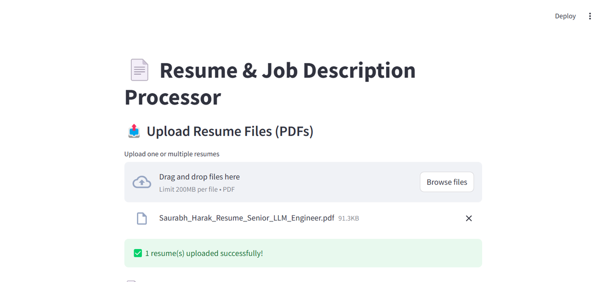
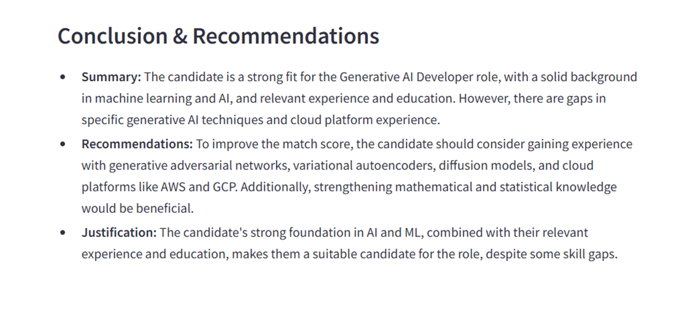

# Resume-JD Analysis

## Overview
Resume-JD Analysis is a tool that evaluates the compatibility between resumes and job descriptions using AI-powered analysis. The application processes resumes and job descriptions, scores their relevance, and provides recommendations to improve alignment. It utilizes natural language processing (NLP) and machine learning techniques to enhance recruitment efficiency.

## Features
- **Resume Parsing:** Extracts relevant information from resumes.
- **JD Analysis:** Evaluates job descriptions to identify key skills and requirements.
- **Scoring System:** Assigns a compatibility score between the resume and job description.
- **Recommendations:** Provides suggestions for improving resume alignment with the job description.
- **Report Generation:** Outputs findings in a structured markdown format.
- **Web UI (Streamlit):** An interactive dashboard to upload and analyze resumes and job descriptions.
## Technology Stack
### **Programming Languages & Frameworks**
- Python 3.8+
- Streamlit (for the web interface)
- LangChain (for AI pipeline integration)

### **AI & NLP Models**
- GPT-4o-mini (for job description and resume data extraction)
- GPT-4o (for scoring and match analysis)

### **Libraries & Tools**
- OpenAI API (for LLM processing)
- LangChain Community (for AI-based processing chains)
- Pandas (for data manipulation)
- NumPy (for numerical computations)
- Matplotlib & Seaborn (for data visualization)
- PyPDF2 (for parsing PDF resumes)
- dotenv (for environment variable management)

### **Deployment & Environment Management**
- Virtual Environments (venv)
- Git & GitHub (for version control)
- `.env` file for storing API keys securely

## Installation
To get started with this project, follow these steps:

### Prerequisites
Ensure you have the following installed:
- Python 3.8+
- pip (Python package manager)

### Clone the Repository
```sh
git clone https://github.com/saurabhharak/resume-jd-analysis.git
cd resume-jd-analysis
```

### Create a Virtual Environment (Optional but Recommended)
```sh
python -m venv venv
source venv/bin/activate  # On Windows use `venv\Scripts\activate`
```

### Install Dependencies
```sh
pip install -r requirements.txt
```

### API Key Configuration
Ensure you set your OpenAI API key in the `.env` file:
```sh
OPENAI_API_KEY=your_api_key_here
```

## Usage
Run the Streamlit application using:
```sh
streamlit run src/app.py
```
This will start the web application, and you can upload resumes and job descriptions for analysis through the UI.

## Project Structure
```
resume-jd-analysis/
│── data/                     # Stores resumes and job descriptions
│   ├── resumes/              # Resume PDF files
│   ├── job_description.txt   # Sample job description
│── notebooks/                # Jupyter notebooks for experimentation
│── reports/                  # Generated analysis reports
│── src/                      # Source code
│   ├── pages/                # Additional Streamlit pages
│   ├── app.py                # Entry point for Streamlit app
│   ├── main.py               # Main script to manage execution flow
│   ├── data_preprocessing.py # Handles data extraction and cleaning
│   ├── llm_analysis.py       # AI/ML model for JD-resume analysis
│   ├── scoring.py            # Scoring logic implementation
│── config.py                 # Configuration settings
│── .env                      # Environment variables
│── README.md                 # Project documentation
│── requirements.txt          # Dependencies list
```

## UI






## Contact
For any inquiries, reach out to jobsforsaurabhharak.com or open an issue in the repository.

